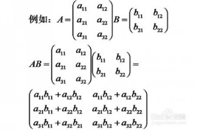

# PID 1230 · 矩阵乘法

[打开 HAUTOJ 原题 ↗](<https://acm.haut.edu.cn/problem.php?id=1230>){ .md-button .md-button--primary target="_blank" rel="noopener" }

!!! info "资料说明"
    本页是依据公开题面、公开解析与可复现代码核验整理的学习资料，不代表学校或校队的官方题解。

## 题目档案

| 项目 | 内容 |
|---|---|
| 训练定位 | 基础提高 |
| 主知识模块 | [数组、字符串与双指针](../topics/arrays-strings.md) |
| 知识标签 | 矩阵、三重循环、线性代数 |
| 时间 / 内存 | 1.000 S / 128 MB |
| 历史统计 | 11 次通过 / 46 次提交（23.9%） |
| 代码来源 | 依据公开题面与解析独立改写 |
| 核验状态 | C++17 编译通过；1 个可机读公开样例/合法构造校验通过 |

接受率只反映抓取时的历史提交快照，不等于官方难度或选拔分数线。

## 周赛出处

- [2016级河南工大新生周赛（五）](../contests/2016/1010.md) · E 题 · 11/46

## 题意与输入输出

**题意摘要**：给你两个n*n的矩阵，请计算并输出它们相乘的结果。

**输入要点**：第1行：1个数N，表示矩阵的大小(2 &lt;= N &lt;= 100) 第2 - N + 1行，每行N个数，对应M1的1行(0 &lt;= M1&#91;i&#93; &lt;= 1000) 第N + 2 - 2N + 1行，每行N个数，对应M2的1行(0 &lt;= M2&#91;i&#93; &lt;= 1000)

**输出要点**：输出共N行，每行N个数，对应M1 * M2的结果的一行。

## 零基础先修

- 训练线性扫描、下标边界、字符处理、连续段和左右指针。这些能力频繁出现在周赛前中段，也是后续算法的实现基础。

## 思路推导

1. 按输入说明读取数据，并用最小样例手算一次，确认每个变量的含义。
2. 把条件翻译成分支或线性扫描，不引入题目没有要求的额外状态。
3. 核心处理：矩阵乘法中结果 C&#91;i&#93;&#91;j&#93; 是 A 第 i 行与 B 第 j 列的点积： `Σ A&#91;i&#93;&#91;k&#93;*B&#91;k&#93;&#91;j&#93;`。用三层循环枚举行、列和公共下标。每行输出时 仅在第 2 个及以后元素前加空格，避免多余分隔。累加使用 long long。
4. 按题目要求输出，并检查最小值、最大值、重复值、单元素和格式边界。

## 正确性说明

- 扫描前保存的信息与已经处理的输入完全对应。
- 每读入一个元素，分支覆盖其全部情况并正确更新累计状态。
- 扫描结束时所有输入恰好处理一次，累计状态即为所求。

## 复杂度

O(n³) 时间、O(n²) 空间

## 易错点

- 按上界估算中间量，相关变量不要退回 int。

## 题目摘要与 C++17 参考实现

--8<-- "includes/problems/haut-1230.md"

## 公开样例

### 样例 1

**输入**

```text
2
1 0
0 1
0 1
1 0
```

**输出**

```text
0 1
1 0
```


## 题面图片




## 训练动作

- 遮住代码，用 3～5 句话复述状态、步骤和复杂度，再独立实现。
- 自行补三个边界：最小规模、极端或全部相等、恰好卡在条件等号处。
- 将本题归档到“数组、字符串与双指针”，一周后限时重做。

## 链接与来源

- [HAUTOJ 原题](<https://acm.haut.edu.cn/problem.php?id=1230>)
- [公开题解/参考来源 1](<https://www.cnblogs.com/hautacm/articles/16816934.html>)

---

<div class="problem-nav" markdown="1">
[← PID 1229](1229.md)
[返回题目索引](index.md)
[PID 1231 →](1231.md)
</div>
