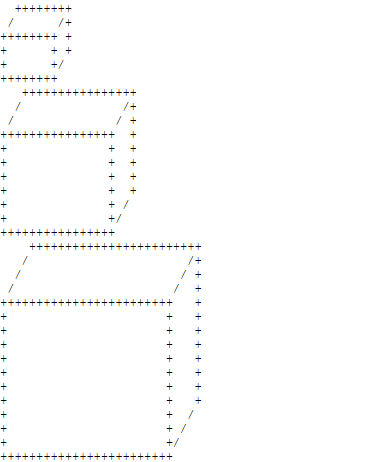

# PID 1501 · 对小19的亲切关怀

[打开 HAUTOJ 原题 ↗](<https://acm.haut.edu.cn/problem.php?id=1501>){ .md-button .md-button--primary target="_blank" rel="noopener" }

!!! info "资料说明"
    本页是依据公开题面、公开解析与可复现代码核验整理的学习资料，不代表学校或校队的官方题解。

## 题目档案

| 项目 | 内容 |
|---|---|
| 训练定位 | 入门 |
| 主知识模块 | [数组、字符串与双指针](../topics/arrays-strings.md) |
| 知识标签 | 字符串、图形输出、文件尾输入 |
| 时间 / 内存 | 1.000 S / 128 MB |
| 历史统计 | 24 次通过 / 42 次提交（57.1%） |
| 代码来源 | 依据公开题面与解析独立改写 |
| 核验状态 | C++14 编译通过；未提供成对公开样例 |

接受率只反映抓取时的历史提交快照，不等于官方难度或选拔分数线。

## 周赛出处

- [2019级河南工大新生周赛（四）@胡维强专场](../contests/2019/1056.md) · D 题 · 24/42

## 题意与输入输出

**题意摘要**：根据给定输入，&#91;图片：https://acm.haut.edu.cn/upload/image/20191124/20191124120744_10903.png&#93;

**输入要点**：1 2 3

**输出要点**：&#91;图片：https://acm.haut.edu.cn/upload/image/20191124/20191124120744_10903.png&#93;

## 零基础先修

- string 可按下标访问字符；注意空串、大小写、标点和 getline 与 cin 的衔接。
- 多组数据读到 EOF 时使用 while (cin &gt;&gt; ...)，不要额外读取不存在的 T。

## 思路推导

1. 按输入说明读取数据，并用最小样例手算一次，确认每个变量的含义。
2. 把条件翻译成分支或线性扫描，不引入题目没有要求的额外状态。
3. 核心处理：图形可拆为宽 8N、高 4N 的正面矩形，以及向右上偏移 N+1 列、 N+1 行的背面。先画背面上边与 N 条斜边，再画正面上边；中间先输出 3N-2 行三条竖边，接着输出 N 行逐列左移的右下斜边，最后画正面 下边。多组 N 读到文件尾，图形之间不插空行。
4. 按题目要求输出，并检查最小值、最大值、重复值、单元素和格式边界。

## 正确性说明

- 扫描前保存的信息与已经处理的输入完全对应。
- 每读入一个元素，分支覆盖其全部情况并正确更新累计状态。
- 扫描结束时所有输入恰好处理一次，累计状态即为所求。

## 复杂度

每组 O(N²) 输出时间、O(N) 临时空间

## 易错点

- 避免下标越界；getline 前要处理上一次格式化读入留下的换行。
- EOF 题不要读取不存在的 T，也不要多输出内容。

## 题目摘要与 C++14 参考实现

--8<-- "includes/problems/haut-1501.md"

## 公开样例

公开页面没有提供可成对提取的样例，请在原题页核对图片或特殊格式。

## 题面图片

## 训练动作

- 遮住代码，用 3～5 句话复述状态、步骤和复杂度，再独立实现。
- 自行补三个边界：最小规模、极端或全部相等、恰好卡在条件等号处。
- 将本题归档到“数组、字符串与双指针”，一周后限时重做。

## 链接与来源

- [HAUTOJ 原题](<https://acm.haut.edu.cn/problem.php?id=1501>)

---

[← PID 1498](1498.md)
[返回题目索引](index.md)
[PID 1502 →](1502.md)

