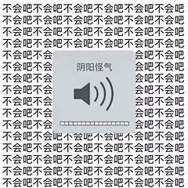

# PID 1529 · 小青的报道

[打开 HAUTOJ 原题 ↗](<https://acm.haut.edu.cn/problem.php?id=1529>){ .md-button .md-button--primary target="_blank" rel="noopener" }

!!! info "资料说明"
    本页是依据公开题面、公开解析与可复现代码核验整理的学习资料，不代表学校或校队的官方题解。

## 题目档案

| 项目 | 内容 |
|---|---|
| 训练定位 | 入门 |
| 主知识模块 | [数学、数论与组合](../topics/math-number-theory.md) |
| 知识标签 | 数论、质因数分解、组合计数 |
| 时间 / 内存 | 1.000 S / 128 MB |
| 历史统计 | 340 次通过 / 526 次提交（64.6%） |
| 代码来源 | 依据公开题面与解析独立改写 |
| 核验状态 | C++14 编译通过；1 个可机读公开样例/合法构造校验通过 |

接受率只反映抓取时的历史提交快照，不等于官方难度或选拔分数线。

## 周赛出处

- [2020级HAUT新生周赛（一）@李晨龙专场](../contests/2020/1060.md) · B 题 · 340/526

## 题意与输入输出

### 题意摘要

根据给定输入，一个正整数，表示问题的答案。

### 输入要点

一个正整数n ($1 \le n \le 10$)

### 输出要点

一个正整数，表示问题的答案。

### 题面提示

4！=24，显然仅有１,2,3,4,6,8,12,24为24的正因数，所以我们输出8就好了

### 题面示意图




## 零基础先修

- 常用整除、gcd/lcm、质数与同余；乘法前先估算是否需要 long long 或 \_\_int128。

## 思路推导

1. 按输入说明读取数据，并用最小样例手算一次，确认每个变量的含义。
2. 从定义推导公式或不变量，并用小数据验证边界、奇偶与整除关系。
3. 核心处理：若 n! 的质因数分解为各质数 p 的 ep 次方，正因子个数就是 ∏(ep+1)。$n \le 10$，可逐个分解 2..n 并累计每个质因数的指数。
4. 按题目要求输出，并检查最小值、最大值、重复值、单元素和格式边界。

## 正确性说明

- 推导把原过程转换为等价的公式或不变量。
- 算法直接计算该等价量，并使用足够宽的数据类型处理边界。
- 因此计算结果就是题目定义的答案。

## 复杂度

O(n√n) 时间、O(质数个数) 空间

## 易错点

- 检查 gcd/lcm 的 0 值、负数和乘法溢出。

## 题目摘要与 C++14 参考实现

--8<-- "includes/problems/haut-1529.md"

## 公开样例

### 样例 1

**输入**

```text
4
```

**输出**

```text
8
```


## 训练动作

- 遮住代码，用 3～5 句话复述状态、步骤和复杂度，再独立实现。
- 自行补三个边界：最小规模、极端或全部相等、恰好卡在条件等号处。
- 将本题归档到“数学、数论与组合”，一周后限时重做。

## 链接与来源

- [HAUTOJ 原题](<https://acm.haut.edu.cn/problem.php?id=1529>)

---

<div class="problem-nav" markdown="1">
[← PID 1528](1528.md)
[返回题目索引](index.md)
[PID 1530 →](1530.md)
</div>
