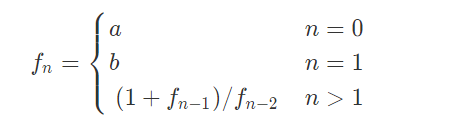

# PID 1547 · 递归式

[打开 HAUTOJ 原题 ↗](<https://acm.haut.edu.cn/problem.php?id=1547>){ .md-button .md-button--primary target="_blank" rel="noopener" }

!!! info "资料说明"
    本页是依据公开题面、公开解析与可复现代码核验整理的学习资料，不代表学校或校队的官方题解。

## 题目档案

| 项目 | 内容 |
|---|---|
| 训练定位 | 入门 |
| 主知识模块 | [数学、数论与组合](../topics/math-number-theory.md) |
| 知识标签 | 数学、递推、周期性 |
| 时间 / 内存 | 1.000 S / 128 MB |
| 历史统计 | 80 次通过 / 163 次提交（49.1%） |
| 代码来源 | 依据公开题面与解析独立改写 |
| 核验状态 | C++14 编译通过；1 个可机读公开样例/合法构造校验通过 |

接受率只反映抓取时的历史提交快照，不等于官方难度或选拔分数线。

## 周赛出处

- [2020级HAUT新生周赛（三）@张雍藓专场](../contests/2020/1062.md) · A 题 · 80/163

## 题意与输入输出

### 题意摘要

根据给定输入，T行,每行一个实数,答案保留三位小数

### 输入要点

第一行为T,代表有T组数据

接下来T行, 每行 两个实数a,b 和一个整数n接下来T行,每行两个实数a，b和一个整数n

$$
1 \le T \le 1e5
$$

$$
1 \le a,b,n \le 1e5
$$

### 输出要点

T行,每行一个实数,答案保留三位小数

### 题面示意图




## 零基础先修

- 把过程转成公式前，先在小数据上验证，再证明公式覆盖所有合法情况。

## 思路推导

1. 按输入说明读取数据，并用最小样例手算一次，确认每个变量的含义。
2. 从定义推导公式或不变量，并用小数据验证边界、奇偶与整除关系。
3. 核心处理：按定义先算 $f0=a$、$f1=b$。把递推式连续展开可发现 $f5=a$、$f6=b$， 因而整个序列以 5 为周期；每组只需算 f0..f4，再取 n%5 对应项。 这也是 T 和 n 都可达 1e5 时不能逐项递推的关键。
4. 按题目要求输出，并检查最小值、最大值、重复值、单元素和格式边界。

## 正确性说明

- 推导把原过程转换为等价的公式或不变量。
- 算法直接计算该等价量，并使用足够宽的数据类型处理边界。
- 因此计算结果就是题目定义的答案。

## 复杂度

每组 O(1) 时间、O(1) 空间

## 易错点

- 乘积使用足够宽的数据类型；除法前处理除数为 0 和整数截断。
- 按上界估算中间量，相关变量不要退回 int。
- setprecision 单独使用表示有效数字；固定小数位时必须配合 fixed。

!!! tip "输出精度"
    `printf` 与 `fixed << setprecision(...)` 都是常见竞赛写法；区别和混用限制见[浮点输出专题](../guide/precision.md)。

## 题目摘要与 C++14 参考实现

--8<-- "includes/problems/haut-1547.md"

## 公开样例

### 样例 1

**输入**

```text
10
11.552433642296053 9.84536372979228 21
9.127610802358296 11.061421019305289 19
5.352034655215464 11.492644371125753 22
1.035865637269147 7.451481779826788 18
9.97708237621654 4.398241324723653 16
10.916270799722476 7.38201491477216 23
9.711021627018521 7.311157633768417 23
10.550401414216932 5.1938809719988175 25
9.997828367794625 10.951453033276481 16
3.806909182276062 4.780967251081492 18
```

**输出**

```text
9.845
0.916
2.334
1.229
4.398
0.239
0.254
10.550
10.951
0.527
```


## 训练动作

- 遮住代码，用 3～5 句话复述状态、步骤和复杂度，再独立实现。
- 自行补三个边界：最小规模、极端或全部相等、恰好卡在条件等号处。
- 将本题归档到“数学、数论与组合”，一周后限时重做。

## 链接与来源

- [HAUTOJ 原题](<https://acm.haut.edu.cn/problem.php?id=1547>)

---

<div class="problem-nav" markdown="1">
[← PID 1546](1546.md)
[返回题目索引](index.md)
[PID 1548 →](1548.md)
</div>
