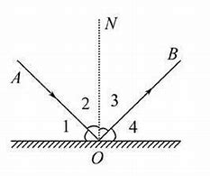
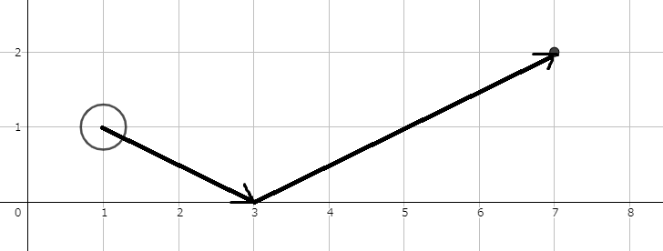

# PID 1550 · 光的反射

[打开 HAUTOJ 原题 ↗](<https://acm.haut.edu.cn/problem.php?id=1550>){ .md-button .md-button--primary target="_blank" rel="noopener" }

!!! info "资料说明"
    本页是依据公开题面、公开解析与可复现代码核验整理的学习资料，不代表学校或校队的官方题解。

## 题目档案

| 项目 | 内容 |
|---|---|
| 训练定位 | 基础提高 |
| 主知识模块 | [计算几何、概率与综合](../topics/geometry-probability.md) |
| 知识标签 | 计算几何、反射法、浮点输出 |
| 时间 / 内存 | 1.000 S / 128 MB |
| 历史统计 | 110 次通过 / 231 次提交（47.6%） |
| 代码来源 | 依据公开题面与解析独立改写 |
| 核验状态 | C++14 编译通过；1 个可机读公开样例/合法构造校验通过 |

接受率只反映抓取时的历史提交快照，不等于官方难度或选拔分数线。

## 周赛出处

- [2020级HAUT新生周赛（三）@张雍藓专场](../contests/2020/1062.md) · D 题 · 110/231

## 题意与输入输出

**题意摘要**：根据给定输入，一个实数，代表在x轴上的位置，结果保留六位小数

**输入要点**：四个实数，分别代表A点坐标x1, y1,B点坐标x2, y2 -1e6 &lt;= x1,x2 &lt;= 1e6 0 &lt;= y1,y2 &lt;= 1e6

**输出要点**：一个实数，代表在x轴上的位置，结果保留六位小数

**题面提示**：下图是样例的解释 &#91;图片：https://acm.haut.edu.cn/upload/image/20201213/20201213135727_98595.png&#93;

## 零基础先修

- 明确坐标系、距离与边界；只比较距离时可用平方距离避免开方。
- 固定小数位可选 printf 或 fixed 配合 setprecision；整份程序不要混用两套 I/O。

## 思路推导

1. 按输入说明读取数据，并用最小样例手算一次，确认每个变量的含义。
2. 把条件翻译成分支或线性扫描，不引入题目没有要求的额外状态。
3. 核心处理：把 B 关于 x 轴反射到 B'(x2,-y2)，则 A→O→B 的反射路径变成 A→O→B' 的直线。用线性插值求这条线在 y=0 时的横坐标： (x1·y2+x2·y1)/(y1+y2)。两点都在轴上时取 x1 即可。
4. 按题目要求输出，并检查最小值、最大值、重复值、单元素和格式边界。

## 正确性说明

- 扫描前保存的信息与已经处理的输入完全对应。
- 每读入一个元素，分支覆盖其全部情况并正确更新累计状态。
- 扫描结束时所有输入恰好处理一次，累计状态即为所求。

## 复杂度

O(1) 时间、O(1) 空间

## 易错点

- 按误差要求保留精度，不要只按样例字符数猜小数位。
- setprecision 单独使用表示有效数字；固定小数位时必须配合 fixed。

!!! tip "输出精度"
    `printf` 与 `fixed << setprecision(...)` 都是常见竞赛写法；区别和混用限制见[浮点输出专题](../guide/precision.md)。

## 题目摘要与 C++14 参考实现

--8<-- "includes/problems/haut-1550.md"

## 公开样例

### 样例 1

**输入**

```text
1 1 7 2
```

**输出**

```text
3.000000
```


## 题面图片






## 训练动作

- 遮住代码，用 3～5 句话复述状态、步骤和复杂度，再独立实现。
- 自行补三个边界：最小规模、极端或全部相等、恰好卡在条件等号处。
- 将本题归档到“计算几何、概率与综合”，一周后限时重做。

## 链接与来源

- [HAUTOJ 原题](<https://acm.haut.edu.cn/problem.php?id=1550>)

---

<div class="problem-nav" markdown="1">
[← PID 1549](1549.md)
[返回题目索引](index.md)
[PID 1551 →](1551.md)
</div>
