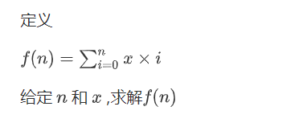

# PID 1553 · 求和

[打开 HAUTOJ 原题 ↗](<https://acm.haut.edu.cn/problem.php?id=1553>){ .md-button .md-button--primary target="_blank" rel="noopener" }

!!! info "资料说明"
    本页是依据公开题面、公开解析与可复现代码核验整理的学习资料，不代表学校或校队的官方题解。

## 题目档案

| 项目 | 内容 |
|---|---|
| 训练定位 | 基础提高 |
| 主知识模块 | [数学、数论与组合](../topics/math-number-theory.md) |
| 知识标签 | 数学、等差数列、公式推导 |
| 时间 / 内存 | 1.000 S / 128 MB |
| 历史统计 | 58 次通过 / 263 次提交（22.1%） |
| 代码来源 | 依据公开题面与解析独立改写 |
| 核验状态 | C++14 编译通过；1 个可机读公开样例/合法构造校验通过 |

接受率只反映抓取时的历史提交快照，不等于官方难度或选拔分数线。

## 周赛出处

- [2020级HAUT新生周赛（三）@张雍藓专场](../contests/2020/1062.md) · G 题 · 58/263

## 题意与输入输出

**题意摘要**：根据给定输入，T行，每行一个整数，表示结果

**输入要点**：多组数据，第一行为T,代表有T组 接下来T行 ,每行两个正整数x和n，用空格隔开 1&lt;=T&lt;=20 1&lt;=x&lt;=10 1&lt;=n&lt;=1e8

**输出要点**：T行，每行一个整数，表示结果

## 零基础先修

- 把过程转成公式前，先在小数据上验证，再证明公式覆盖所有合法情况。

## 思路推导

1. 按输入说明读取数据，并用最小样例手算一次，确认每个变量的含义。
2. 从定义推导公式或不变量，并用小数据验证边界、奇偶与整除关系。
3. 核心处理：题图定义 f(n)=Σ(i=0..n)x·i。提出常数 x，再用等差数列求和 0+1+…+n=n(n+1)/2，得到 f(n)=x·n(n+1)/2。乘法使用 long long。
4. 按题目要求输出，并检查最小值、最大值、重复值、单元素和格式边界。

## 正确性说明

- 推导把原过程转换为等价的公式或不变量。
- 算法直接计算该等价量，并使用足够宽的数据类型处理边界。
- 因此计算结果就是题目定义的答案。

## 复杂度

每组 O(1) 时间、O(1) 空间

## 易错点

- 乘积使用足够宽的数据类型；除法前处理除数为 0 和整数截断。
- 按上界估算中间量，相关变量不要退回 int。

## 题目摘要与 C++14 参考实现

--8<-- "includes/problems/haut-1553.md"

## 公开样例

### 样例 1

**输入**

```text
5
5 7
2 10
2 4
1 8
10 100000000
```

**输出**

```text
140
110
20
36
50000000500000000
```


## 题面图片




## 训练动作

- 遮住代码，用 3～5 句话复述状态、步骤和复杂度，再独立实现。
- 自行补三个边界：最小规模、极端或全部相等、恰好卡在条件等号处。
- 将本题归档到“数学、数论与组合”，一周后限时重做。

## 链接与来源

- [HAUTOJ 原题](<https://acm.haut.edu.cn/problem.php?id=1553>)

---

<div class="problem-nav" markdown="1">
[← PID 1552](1552.md)
[返回题目索引](index.md)
[PID 1554 →](1554.md)
</div>
