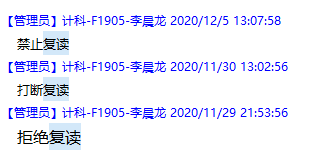
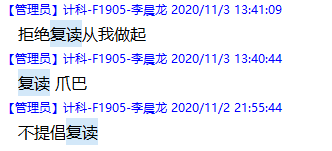

# PID 1561 · 禁止复读

[打开 HAUTOJ 原题 ↗](<https://acm.haut.edu.cn/problem.php?id=1561>){ .md-button .md-button--primary target="_blank" rel="noopener" }

!!! info "资料说明"
    本页是依据公开题面、公开解析与可复现代码核验整理的学习资料，不代表学校或校队的官方题解。

## 题目档案

| 项目 | 内容 |
|---|---|
| 训练定位 | 进阶 |
| 主知识模块 | [数据结构](../topics/data-structures.md) |
| 知识标签 | 字符串、连续段、集合、模拟 |
| 时间 / 内存 | 1.000 S / 128 MB |
| 历史统计 | 3 次通过 / 90 次提交（3.3%） |
| 代码来源 | 依据公开题面与解析独立改写 |
| 核验状态 | C++17 编译通过；1 个可机读公开样例/合法构造校验通过 |

接受率只反映抓取时的历史提交快照，不等于官方难度或选拔分数线。

## 周赛出处

- [2020级HAUT新生周赛（四）@张承树专场](../contests/2020/1063.md) · G 题 · 3/90

## 题意与输入输出

**题意摘要**：根据给定输入，第一行一个k输出被禁言人的个数。 第二行由小到大输出k个整数，表示被禁言的人是谁。 如果k=0，则输出空行即可

**输入要点**：第一行一个n，代表群里的消息条数。 第2到n+1行为聊天记录，每行为一个数字x和一个字符串s，x表示发言的人的编号，s表示这个人说的话。 1&lt;=n&lt;=1000,1&lt;=|s|&lt;=50 0&lt;=x&lt;=1000

**输出要点**：第一行一个k输出被禁言人的个数。 第二行由小到大输出k个整数，表示被禁言的人是谁。 如果k=0，则输出空行即可

**题面提示**：2复读了1说的话发起了'lcltql'的复读，3并没有发起复读，4一个人发起了'%%%lcl'的复读，因此2和4将被禁言

## 零基础先修

- string 可按下标访问字符；注意空串、大小写、标点和 getline 与 cin 的衔接。
- 集合适合去重与成员查询；需要有序输出时使用 set 或最后排序。
- 列出状态变量与更新时间，严格按照题面规定的事件顺序更新。

## 思路推导

1. 按输入说明读取数据，并用最小样例手算一次，确认每个变量的含义。
2. 列出状态变量并按题面顺序更新；构造题同时维护每条输出约束。
3. 核心处理：“发起复读”只指一段相同消息中的第二条，而不是第三条、第四条。 因此当前消息等于上一条、且上一条不是其前一条的延续时，才把当前 发言者加入集合。set 同时完成去重和编号升序。
4. 按题目要求输出，并检查最小值、最大值、重复值、单元素和格式边界。

## 正确性说明

- 初始变量与题面初始状态相同。
- 若某一步前状态正确，本步按相同顺序和规则更新后仍保持一致。
- 由归纳法，全部步骤结束时程序状态与答案都正确。

## 复杂度

O(n log n) 时间、O(n) 空间

## 易错点

- 避免下标越界；getline 前要处理上一次格式化读入留下的换行。
- 按规定顺序更新，避免本轮新状态在同一轮被重复使用。

## 题目摘要与 C++17 参考实现

--8<-- "includes/problems/haut-1561.md"

## 公开样例

### 样例 1

**输入**

```text
5
1 lcltql
2 lcltql
3 lcltql
4 %%%lcl
4 %%%lcl
```

**输出**

```text
2
2 4
```


## 题面图片






## 训练动作

- 遮住代码，用 3～5 句话复述状态、步骤和复杂度，再独立实现。
- 自行补三个边界：最小规模、极端或全部相等、恰好卡在条件等号处。
- 将本题归档到“数据结构”，一周后限时重做。

## 链接与来源

- [HAUTOJ 原题](<https://acm.haut.edu.cn/problem.php?id=1561>)

---

<div class="problem-nav" markdown="1">
[← PID 1560](1560.md)
[返回题目索引](index.md)
[PID 1562 →](1562.md)
</div>
