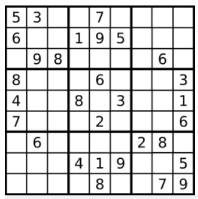

# PID 1595 · 牛牛的数独

[打开 HAUTOJ 原题 ↗](<https://acm.haut.edu.cn/problem.php?id=1595>){ .md-button .md-button--primary target="_blank" rel="noopener" }

!!! info "资料说明"
    本页是依据公开题面、公开解析与可复现代码核验整理的学习资料，不代表学校或校队的官方题解。

## 题目档案

| 项目 | 内容 |
|---|---|
| 训练定位 | 进阶 |
| 主知识模块 | [数组、字符串与双指针](../topics/arrays-strings.md) |
| 知识标签 | 条件分支、数组与序列 |
| 时间 / 内存 | 1.000 S / 128 MB |
| 历史统计 | 6 次通过 / 22 次提交（27.3%） |
| 代码来源 | 依据公开题解整理 |
| 核验状态 | C++14 编译通过；1 个可机读公开样例/合法构造校验通过 |

接受率只反映抓取时的历史提交快照，不等于官方难度或选拔分数线。

## 周赛出处

- [2021级HAUT新生周赛（二）@李亚凯专场](../contests/2021/1070.md) · H 题 · 6/22

## 题意与输入输出

**题意摘要**：牛牛遇到了一个9×9的数独，你能帮牛牛判断数独是否有效。只需要根据以下规则，验证已经填入的数字是否有效即可。

**输入要点**：输入有9行，每行有9个区间为&#91;0,9&#93;的整数，其中用0表示空白，整数之间用空格隔开。

**输出要点**：如果数独有效输出yes，否则则输出no。

## 零基础先修

- if/else 按互斥条件选择处理路径；先覆盖特殊边界，再处理一般情况。
- 明确 0/1 起下标、合法范围、首尾元素和扫描过程中保存的信息。

## 思路推导

1. 按输入说明读取数据，并用最小样例手算一次，确认每个变量的含义。
2. 把条件翻译成分支或线性扫描，不引入题目没有要求的额外状态。
3. 核心处理：牛牛的数独这题用数组模拟判断，判断行，列，九宫格时可以开一个数组进行标记。
4. 按题目要求输出，并检查最小值、最大值、重复值、单元素和格式边界。

## 正确性说明

- 扫描前保存的信息与已经处理的输入完全对应。
- 每读入一个元素，分支覆盖其全部情况并正确更新累计状态。
- 扫描结束时所有输入恰好处理一次，累计状态即为所求。

## 复杂度

通常为 O(n)

## 易错点

- 条件应互斥并覆盖所有边界，尤其确认等号属于哪一侧。
- 检查 0/1 起下标、n = 1、首尾元素和数组容量。

!!! tip "输出精度"
    `printf` 与 `fixed << setprecision(...)` 都是常见竞赛写法；区别和混用限制见[浮点输出专题](../guide/precision.md)。

## 题目摘要与 C++14 参考实现

--8<-- "includes/problems/haut-1595.md"

## 公开样例

### 样例 1

**输入**

```text
5 3 0 0 7 0 0 0 0
6 0 0 1 9 5 0 0 0
0 9 8 0 0 0 0 6 0
8 0 0 0 6 0 0 0 3
4 0 0 8 0 3 0 0 1
7 0 0 0 2 0 0 0 6
0 6 0 0 0 0 2 8 0
0 0 0 4 1 9 0 0 5
0 0 0 0 8 0 0 7 9
```

**输出**

```text
yes
```


## 题面图片




## 训练动作

- 遮住代码，用 3～5 句话复述状态、步骤和复杂度，再独立实现。
- 自行补三个边界：最小规模、极端或全部相等、恰好卡在条件等号处。
- 将本题归档到“数组、字符串与双指针”，一周后限时重做。

## 链接与来源

- [HAUTOJ 原题](<https://acm.haut.edu.cn/problem.php?id=1595>)
- [公开题解/参考来源 1](<https://blog.nowcoder.net/n/8d0b8e015468490ab96ec5ff7487bba2>)

---

<div class="problem-nav" markdown="1">
[← PID 1594](1594.md)
[返回题目索引](index.md)
[PID 1596 →](1596.md)
</div>
