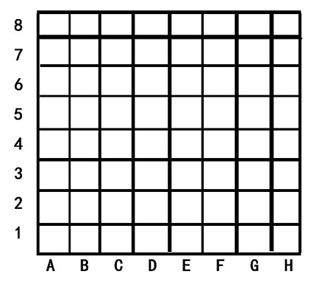

# PID 1715 · lwyj的最短路径

[打开 HAUTOJ 原题 ↗](<https://acm.haut.edu.cn/problem.php?id=1715>){ .md-button .md-button--primary target="_blank" rel="noopener" }

!!! info "资料说明"
    本页是依据公开题面、公开解析与可复现代码核验整理的学习资料，不代表学校或校队的官方题解。

## 题目档案

| 项目 | 内容 |
|---|---|
| 训练定位 | 进阶 |
| 主知识模块 | [搜索、图论与树](../topics/search-graphs-trees.md) |
| 知识标签 | 模拟、图论、数学 |
| 时间 / 内存 | 1.000 S / 128 MB |
| 历史统计 | 2 次通过 / 14 次提交（14.3%） |
| 代码来源 | 依据公开题解整理 |
| 核验状态 | C++14 编译通过；1 个可机读公开样例/合法构造校验通过 |

接受率只反映抓取时的历史提交快照，不等于官方难度或选拔分数线。

## 周赛出处

- [2021级HAUT新生周赛（五）@常浩锋专场](../contests/2021/1073.md) · G 题 · 2/14

## 题意与输入输出

### 题意摘要

这天lwyj走在一个类似棋盘的地面上(如下图所示)，分别给出lwyj的起点坐标和终点坐标，现在要找出从起点到终点的最短距离，lwyj一眼就看出了答案然后想要考考你，lwyj知道你也肯定很聪明，请你找出从起点到终点最短路径的长度及最短路径的走法并按相应的格式输出(路径最短的同时优先斜着走)

### 输入要点

第一行是lwyj的起点坐标，第二行是lwyj的终点坐标。每个坐标由横向坐标A-H和纵向坐标1-8组成(中间没有空格)

### 输出要点

在第一行中输出一个正整数n，其中n为lwyj从起点走到终点的最小步数。然后在接下来的n行中输出lwyj的动作。每个动作都用8个动作中的一个来描述:L, R, U, D, LU, LD, RU或RD。

L、R、U、D分别代表左、右、上、下移动，2个字母组合代表对角线移动，路径最短的同时优先斜着走

### 题面提示

根据样例看图模拟一下过程即可。

### 题面示意图




## 零基础先修

- 列出状态变量与更新时间，严格按照题面规定的事件顺序更新。
- 建图前明确点、边和方向；邻接表遍历通常是 O(V + E)。
- 把过程转成公式前，先在小数据上验证，再证明公式覆盖所有合法情况。

## 思路推导

1. 按输入说明读取数据，并用最小样例手算一次，确认每个变量的含义。
2. 把对象建成点和边，初始化访问或距离信息，再按选定算法扩展。
3. 核心处理：lwyj的最短路径 思路：本题采用贪心的思想，也就是说可以斜着走就斜着走，因为这样其实是一步走两个格子，当不能斜着走的时候再水平移动或者竖直移动。 具体分析：首先要明确一点，从起点到终点本质上的区别是竖直方向距离和水平方向距离的区别，那么走一步产生的影响有三种，水平方向间距减少1，竖直方向间距减少1，水平方向和竖直方向的间距同时减少1。那么很显然最少的操作数就是水平方向间距的差值和竖直方向间距的差值的最大值(由起点到终点的最理想状态)，分析完了这个之后我们可以直接写代码了。 第一种写法：从起点到终点的横纵坐标的差值有四种情况(根据正负的组合即可得出有四种)，那么我们可以分开讨论再模拟走的过程并输出相应的操作即可
4. 按题目要求输出，并检查最小值、最大值、重复值、单元素和格式边界。

## 正确性说明

- 建图把每个合法对象或状态映射为点，把合法关系映射为边。
- 扩展操作覆盖所有且仅覆盖合法转移，访问标记避免重复处理。
- 遍历结束后的可达性、距离或累计值与原问题一一对应。

## 复杂度

按一次完整遍历估算，通常为 O(n+m)

## 易错点

- 按规定顺序更新，避免本轮新状态在同一轮被重复使用。
- 核对有向/无向、重边、自环、不可达点和点编号范围。
- 乘积使用足够宽的数据类型；除法前处理除数为 0 和整数截断。

## 题目摘要与 C++14 参考实现

--8<-- "includes/problems/haut-1715.md"

## 公开样例

### 样例 1

**输入**

```text
G6
D5
```

**输出**

```text
3
LD
L
L
```


## 训练动作

- 遮住代码，用 3～5 句话复述状态、步骤和复杂度，再独立实现。
- 自行补三个边界：最小规模、极端或全部相等、恰好卡在条件等号处。
- 将本题归档到“搜索、图论与树”，一周后限时重做。

## 链接与来源

- [HAUTOJ 原题](<https://acm.haut.edu.cn/problem.php?id=1715>)
- [公开题解/参考来源 1](<https://blog.csdn.net/m0_52909738/article/details/120599422>)

---

<div class="problem-nav" markdown="1">
[← PID 1714](1714.md)
[返回题目索引](index.md)
[PID 1716 →](1716.md)
</div>
