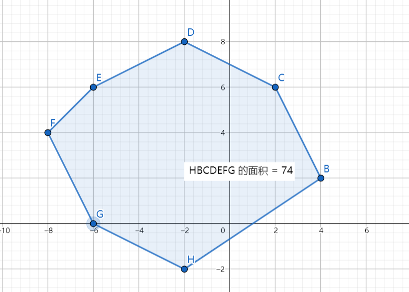

# PID 1734 · 似乎在梦里见过那样

[打开 HAUTOJ 原题 ↗](<https://acm.haut.edu.cn/problem.php?id=1734>){ .md-button .md-button--primary target="_blank" rel="noopener" }

!!! info "资料说明"
    本页是依据公开题面、公开解析与可复现代码核验整理的学习资料，不代表学校或校队的官方题解。

## 题目档案

| 项目 | 内容 |
|---|---|
| 训练定位 | 基础提高 |
| 主知识模块 | [搜索、图论与树](../topics/search-graphs-trees.md) |
| 知识标签 | 图论、数学、数组与序列 |
| 时间 / 内存 | 1.000 S / 128 MB |
| 历史统计 | 45 次通过 / 101 次提交（44.6%） |
| 代码来源 | 依据公开题解整理 |
| 核验状态 | C++17 编译通过；1 个可机读公开样例/合法构造校验通过 |

接受率只反映抓取时的历史提交快照，不等于官方难度或选拔分数线。

## 周赛出处

- [2021级HAUT新生周赛（八）@孔维飒专场](../contests/2021/1076.md) · A 题 · 45/101

## 题意与输入输出

**题意摘要**：根据给定输入，多边形的面积，输出保留两位小数。

**输入要点**：第一行给出多边形的顶点数n(3&lt;=n≤100)。接下来的几行每行给出多边形一个顶点的坐标值X和Y(都为整数并且用空格隔开)。 顶点按逆时针方向逐个给出。并且多边形的每一个顶点的坐标值−200≤x,y≤200。 多边形最后是靠从最后一个顶点到第一个顶点画一条边来封闭的。

**输出要点**：多边形的面积，输出保留两位小数。

**题面提示**：&#91;图片：https://acm.haut.edu.cn/upload/image/20211205/20211205184952_37626.png&#93; 样例图示

## 零基础先修

- 建图前明确点、边和方向；邻接表遍历通常是 O(V + E)。
- 把过程转成公式前，先在小数据上验证，再证明公式覆盖所有合法情况。
- 明确 0/1 起下标、合法范围、首尾元素和扫描过程中保存的信息。

## 思路推导

1. 按输入说明读取数据，并用最小样例手算一次，确认每个变量的含义。
2. 把对象建成点和边，初始化访问或距离信息，再按选定算法扩展。
3. 核心处理：似乎在梦里见过那样（ 传送门）题目大意是求出一个凸多边形的面积。 我们根据高中知识可以得出，在面对求一个多边形面积时，如果多边形是三角形或者四边形可以直接使用公式来进行计算，那么遇见一个多边形一般是将一个多边形划分成为多个 三角形. 那么我们只需要求出划分出来的三角形的面积，之后再进行求和即可。 那么我们再想一下如何划分三角形，由于题目给出了了是 凸多边形，发现只要固定一个点，剩下的两个点在多边形的逆时针的点上依次选取即可，如图所示。 样例的图经过这样划分后就划分成为5个多边形，这样求出5个三角形就求出凸多边形面积了。 那么这样分为什么是正确的？如果换成凹多边形是否正确？ 由于是凸多边形，那么这样划分的下一个三角形不会和上一个三角形有交集，而这样划分的三角形又可以覆盖整个多边形，所以是正确的。 但是如果是凹多边形就会出现错误，会出现重复的部分，并且会出现三角形外部的部分，如： 凹多边形的面积可以使用容斥原理，就是一些划分三角形面积记位正值，一些记位负值，这样就可以求出了。这里不过多涉及，但是标程代码可以实现求出凹多边形的面积 还有一点精度问题，这里使用叉乘的方式求出面积，就是三角形两个边的向量的叉乘结果是三角形面积两倍。 时间复杂度 O(n)O(n)O(n)
4. 按题目要求输出，并检查最小值、最大值、重复值、单元素和格式边界。

## 正确性说明

- 建图把每个合法对象或状态映射为点，把合法关系映射为边。
- 扩展操作覆盖所有且仅覆盖合法转移，访问标记避免重复处理。
- 遍历结束后的可达性、距离或累计值与原问题一一对应。

## 复杂度

O(n)

## 易错点

- 核对有向/无向、重边、自环、不可达点和点编号范围。
- 乘积使用足够宽的数据类型；除法前处理除数为 0 和整数截断。
- 检查 0/1 起下标、n = 1、首尾元素和数组容量。

!!! tip "输出精度"
    `printf` 与 `fixed << setprecision(...)` 都是常见竞赛写法；区别和混用限制见[浮点输出专题](../guide/precision.md)。

## 题目摘要与 C++17 参考实现

--8<-- "includes/problems/haut-1734.md"

## 公开样例

### 样例 1

**输入**

```text
7
4 2
2 6
-2 8
-6 6
-8 4
-6 0
-2 -2
```

**输出**

```text
74.00
```


## 题面图片




## 训练动作

- 遮住代码，用 3～5 句话复述状态、步骤和复杂度，再独立实现。
- 自行补三个边界：最小规模、极端或全部相等、恰好卡在条件等号处。
- 将本题归档到“搜索、图论与树”，一周后限时重做。

## 链接与来源

- [HAUTOJ 原题](<https://acm.haut.edu.cn/problem.php?id=1734>)
- [公开题解/参考来源 1](<https://blog.nowcoder.net/n/a20887f199794f889b9087f0033d4353>)

---

<div class="problem-nav" markdown="1">
[← PID 1733](1733.md)
[返回题目索引](index.md)
[PID 1735 →](1735.md)
</div>
