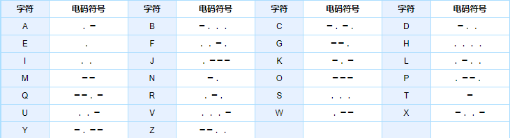

# PID 1766 · 绝对不能回邮件哦

[打开 HAUTOJ 原题 ↗](<https://acm.haut.edu.cn/problem.php?id=1766>){ .md-button .md-button--primary target="_blank" rel="noopener" }

!!! info "资料说明"
    本页是依据公开题面、公开解析与可复现代码核验整理的学习资料，不代表学校或校队的官方题解。

## 题目档案

| 项目 | 内容 |
|---|---|
| 训练定位 | 基础提高 |
| 主知识模块 | [数组、字符串与双指针](../topics/arrays-strings.md) |
| 知识标签 | 字符串、查表、模拟 |
| 时间 / 内存 | 1.000 S / 128 MB |
| 历史统计 | 125 次通过 / 226 次提交（55.3%） |
| 代码来源 | 依据公开题面与解析独立改写 |
| 核验状态 | C++14 编译通过；1 个可机读公开样例/合法构造校验通过 |

接受率只反映抓取时的历史提交快照，不等于官方难度或选拔分数线。

## 周赛出处

- [2022级HAUT新生周赛（二）@武其轩专场](../contests/2022/1080.md) · E 题 · 125/226

## 题意与输入输出

### 题意摘要

根据给定输入，输出占一行，为经转换后的二进制文字。

### 输入要点

输入一个长度不超过1000的字符串，只包含大写英文字母和空格。

### 输出要点

输出占一行，为经转换后的二进制文字。

### 题面示意图




## 零基础先修

- string 可按下标访问字符；注意空串、大小写、标点和 getline 与 cin 的衔接。
- 列出状态变量与更新时间，严格按照题面规定的事件顺序更新。

## 思路推导

1. 按输入说明读取数据，并用最小样例手算一次，确认每个变量的含义。
2. 列出状态变量并按题面顺序更新；构造题同时维护每条输出约束。
3. 核心处理：题面已经按 A 到 Z 给出 26 个摩斯编码，直接存入字符串数组。 逐字符扫描原文：空格原样输出，大写字母 c 用表中 c-'A' 的位置替换。 不要在相邻字母编码之间自行加分隔符，因为样例和题意都要求直接拼接。
4. 按题目要求输出，并检查最小值、最大值、重复值、单元素和格式边界。

## 正确性说明

- 初始变量与题面初始状态相同。
- 若某一步前状态正确，本步按相同顺序和规则更新后仍保持一致。
- 由归纳法，全部步骤结束时程序状态与答案都正确。

## 复杂度

O(|s|+输出长度) 时间、O(1) 额外空间

## 易错点

- 避免下标越界；getline 前要处理上一次格式化读入留下的换行。
- 按规定顺序更新，避免本轮新状态在同一轮被重复使用。

## 题目摘要与 C++14 参考实现

--8<-- "includes/problems/haut-1766.md"

## 公开样例

### 样例 1

**输入**

```text
HELLO WORLD
```

**输出**

```text
0000001000100111 0111110100100100
```


## 训练动作

- 遮住代码，用 3～5 句话复述状态、步骤和复杂度，再独立实现。
- 自行补三个边界：最小规模、极端或全部相等、恰好卡在条件等号处。
- 将本题归档到“数组、字符串与双指针”，一周后限时重做。

## 链接与来源

- [HAUTOJ 原题](<https://acm.haut.edu.cn/problem.php?id=1766>)

---

<div class="problem-nav" markdown="1">
[← PID 1765](1765.md)
[返回题目索引](index.md)
[PID 1767 →](1767.md)
</div>
