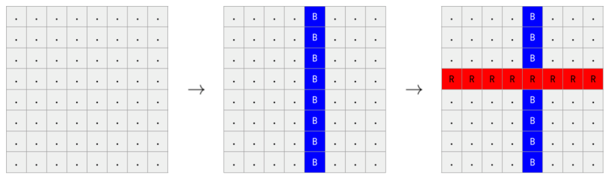

# PID 1775 · 关键词

[打开 HAUTOJ 原题 ↗](<https://acm.haut.edu.cn/problem.php?id=1775>){ .md-button .md-button--primary target="_blank" rel="noopener" }

!!! info "资料说明"
    本页是依据公开题面、公开解析与可复现代码核验整理的学习资料，不代表学校或校队的官方题解。

## 题目档案

| 项目 | 内容 |
|---|---|
| 训练定位 | 进阶 |
| 主知识模块 | [搜索、图论与树](../topics/search-graphs-trees.md) |
| 知识标签 | 观察、网格、模拟 |
| 时间 / 内存 | 1.000 S / 128 MB |
| 历史统计 | 17 次通过 / 106 次提交（16.0%） |
| 代码来源 | 依据公开题面与解析独立改写 |
| 核验状态 | C++17 编译通过；1 个可机读公开样例/合法构造校验通过 |

接受率只反映抓取时的历史提交快照，不等于官方难度或选拔分数线。

## 周赛出处

- [2022级HAUT新生周赛（三）@焦小航专场](../contests/2022/1081.md) · F 题 · 17/106

## 题意与输入输出

**题意摘要**：根据给定输入，最后涂画的颜色是哪种颜色，如果是红色输出R，否则输出B

**输入要点**：第一行给出一个 t，代表有t组询问。 （ 1 &lt;= t &lt;= 4000 ） 每组包括一个 8 X 8 的 网格。 每组之间有个空格

**输出要点**：最后涂画的颜色是哪种颜色，如果是红色输出R，否则输出B

## 零基础先修

- 列出状态变量与更新时间，严格按照题面规定的事件顺序更新。

## 思路推导

1. 按输入说明读取数据，并用最小样例手算一次，确认每个变量的含义。
2. 列出状态变量并按题面顺序更新；构造题同时维护每条输出约束。
3. 核心处理：最后若画的是红色，最终网格一定还保留一整行 R；若不存在整行 R，最后一次只能是覆盖某列的蓝色。枚举 8 行，找到全 R 行输出 R， 否则输出 B。这是由“后画覆盖先画”推出的判定，不必还原全部操作。
4. 按题目要求输出，并检查最小值、最大值、重复值、单元素和格式边界。

## 正确性说明

- 初始变量与题面初始状态相同。
- 若某一步前状态正确，本步按相同顺序和规则更新后仍保持一致。
- 由归纳法，全部步骤结束时程序状态与答案都正确。

## 复杂度

每组 O(64) 时间、O(64) 空间

## 易错点

- 按规定顺序更新，避免本轮新状态在同一轮被重复使用。

## 题目摘要与 C++17 参考实现

--8<-- "includes/problems/haut-1775.md"

## 公开样例

### 样例 1

**输入**

```text
1
....B...
....B...
....B...
RRRRRRRR
....B...
....B...
....B...
....B...
```

**输出**

```text
R
```


## 题面图片





## 训练动作

- 遮住代码，用 3～5 句话复述状态、步骤和复杂度，再独立实现。
- 自行补三个边界：最小规模、极端或全部相等、恰好卡在条件等号处。
- 将本题归档到“搜索、图论与树”，一周后限时重做。

## 链接与来源

- [HAUTOJ 原题](<https://acm.haut.edu.cn/problem.php?id=1775>)

---

<div class="problem-nav" markdown="1">
[← PID 1774](1774.md)
[返回题目索引](index.md)
[PID 1776 →](1776.md)
</div>
