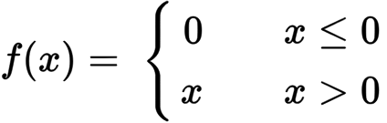

# PID 1863 · ReLU 函数

[打开 HAUTOJ 原题 ↗](<https://acm.haut.edu.cn/problem.php?id=1863>){ .md-button .md-button--primary target="_blank" rel="noopener" }

!!! info "资料说明"
    本页是依据公开题面、公开解析与可复现代码核验整理的学习资料，不代表学校或校队的官方题解。

## 题目档案

| 项目 | 内容 |
|---|---|
| 训练定位 | 进阶 |
| 主知识模块 | [入门语法、输入输出与格式](../topics/syntax-io.md) |
| 知识标签 | 条件分支、分段函数 |
| 时间 / 内存 | 1.000 S / 128 MB |
| 历史统计 | 646 次通过 / 981 次提交（65.9%） |
| 代码来源 | 依据公开题面与解析独立改写 |
| 核验状态 | C++17 编译通过；1 个可机读公开样例/合法构造校验通过 |

接受率只反映抓取时的历史提交快照，不等于官方难度或选拔分数线。

## 周赛出处

- [河南工大2025新生周赛（1）——命题人：程立老师，马家硕](../contests/2025/1100.md) · H 题 · 348/525
- [河南工大2024新生周赛（2）——命题人：马家硕](../contests/2024/1092.md) · A 题 · 298/456

## 题意与输入输出

**题意摘要**：根据给定输入，输出一个数字：x 经过 f(x) 计算后的结果。

**输入要点**：输入一个整数 x (-10⁴ ≤ x ≤ 10⁴)，代表传递给 f(x) 的参数。

**输出要点**：输出一个数字：x 经过 f(x) 计算后的结果。

**题面提示**：样例输入 2 -1 样例输出 2 0 样例输入 3 1 样例输出 3 1 样例输入 4 2 样例输出 4 2

## 零基础先修

- if/else 按互斥条件选择处理路径；先覆盖特殊边界，再处理一般情况。

## 思路推导

1. 按输入说明读取数据，并用最小样例手算一次，确认每个变量的含义。
2. 把条件翻译成分支或线性扫描，不引入题目没有要求的额外状态。
3. 核心处理：ReLU 定义为 max(0,x)：x≤0 时输出 0，否则输出 x。
4. 按题目要求输出，并检查最小值、最大值、重复值、单元素和格式边界。

## 正确性说明

- 扫描前保存的信息与已经处理的输入完全对应。
- 每读入一个元素，分支覆盖其全部情况并正确更新累计状态。
- 扫描结束时所有输入恰好处理一次，累计状态即为所求。

## 复杂度

O(1) 时间、O(1) 空间

## 易错点

- 条件应互斥并覆盖所有边界，尤其确认等号属于哪一侧。

## 题目摘要与 C++17 参考实现

--8<-- "includes/problems/haut-1863.md"

## 公开样例

### 样例 1

**输入**

```text
-2
```

**输出**

```text
0
```


## 题面图片




## 训练动作

- 遮住代码，用 3～5 句话复述状态、步骤和复杂度，再独立实现。
- 自行补三个边界：最小规模、极端或全部相等、恰好卡在条件等号处。
- 将本题归档到“入门语法、输入输出与格式”，一周后限时重做。

## 链接与来源

- [HAUTOJ 原题](<https://acm.haut.edu.cn/problem.php?id=1863>)
- [公开题解/参考来源 1](<https://www.cnblogs.com/hautacm/p/19172759>)
- [公开题解/参考来源 2](<https://www.cnblogs.com/hautacm/articles/18528961>)

---

<div class="problem-nav" markdown="1">
[← PID 1862](1862.md)
[返回题目索引](index.md)
[PID 1864 →](1864.md)
</div>
