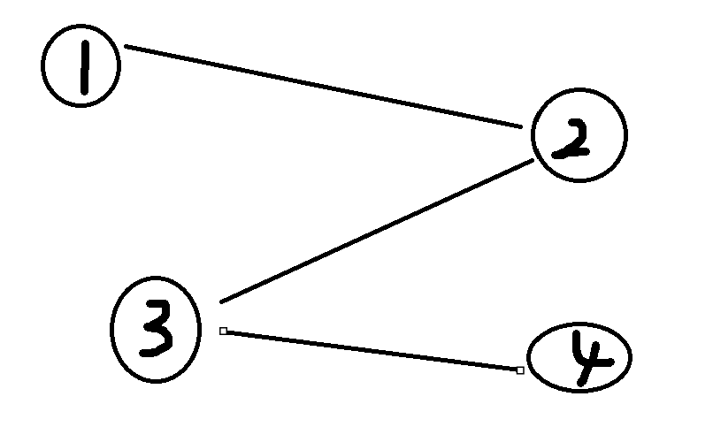

# PID 1890 · 离散数学

[打开 HAUTOJ 原题 ↗](<https://acm.haut.edu.cn/problem.php?id=1890>){ .md-button .md-button--primary target="_blank" rel="noopener" }

!!! info "资料说明"
    本页是依据公开题面、公开解析与可复现代码核验整理的学习资料，不代表学校或校队的官方题解。

## 题目档案

| 项目 | 内容 |
|---|---|
| 训练定位 | 基础提高 |
| 主知识模块 | [搜索、图论与树](../topics/search-graphs-trees.md) |
| 知识标签 | 图论 |
| 时间 / 内存 | 1.000 S / 128 MB |
| 历史统计 | 12 次通过 / 26 次提交（46.2%） |
| 代码来源 | 依据公开题解整理 |
| 核验状态 | C++17 编译通过；1 个可机读公开样例/合法构造校验通过 |

接受率只反映抓取时的历史提交快照，不等于官方难度或选拔分数线。

## 周赛出处

- [河南工大2024新生周赛（5）——命题人：刘庭铄](../contests/2024/1095.md) · D 题 · 12/26

## 题意与输入输出

**题意摘要**：定义这个图的复杂度是：你有任意次操作，每次操作合并两个联通块，合并后联通块大小为二者之和，最后剩下两个联通块大小的乘积为此图的复杂度，若只有一个联通块则复杂度为0。你需要最大化此图复杂度

**输入要点**：第一行包包含两个整数 n 和 m ， 图中顶点的数量和边的数量。 接下来的每 m 行包含两个整数 u 和 v ， 表示图中顶点 u 和 v 之间有一条无向边 （0 &lt; n &lt;= 1e6 , 0 &lt;= m &lt;= 1e6 , 0 &lt; u , v &lt;= n）

**输出要点**：输出一个整数表示最大代价

**题面提示**：本题不涉及数据结构中图的内容，请大家认真读题 样例图如下 &#91;图片：https://acm.haut.edu.cn/upload/acm.haut.edu.cn/image/20241126/20241126194857_96048.png&#93;

## 零基础先修

- 建图前明确点、边和方向；邻接表遍历通常是 O(V + E)。

## 思路推导

1. 按输入说明读取数据，并用最小样例手算一次，确认每个变量的含义。
2. 把对象建成点和边，初始化访问或距离信息，再按选定算法扩展。
3. 核心处理：离散数学 题目中说明：拥有无数次删除操作 则直接将图删除为n个点 ， 由基本不等式 a2 + b2 &gt;= 2ab得 当a 与 b尽量接近时 ， 求得的复杂度最大
4. 按题目要求输出，并检查最小值、最大值、重复值、单元素和格式边界。

## 正确性说明

- 建图把每个合法对象或状态映射为点，把合法关系映射为边。
- 扩展操作覆盖所有且仅覆盖合法转移，访问标记避免重复处理。
- 遍历结束后的可达性、距离或累计值与原问题一一对应。

## 复杂度

按一次完整遍历估算，通常为 O(n+m)

## 易错点

- 核对有向/无向、重边、自环、不可达点和点编号范围。
- 按上界估算中间量，相关变量不要退回 int。

## 题目摘要与 C++17 参考实现

--8<-- "includes/problems/haut-1890.md"

## 公开样例

### 样例 1

**输入**

```text
4 3
1 2
2 3
3 4
```

**输出**

```text
4
```


## 题面图片




## 训练动作

- 遮住代码，用 3～5 句话复述状态、步骤和复杂度，再独立实现。
- 自行补三个边界：最小规模、极端或全部相等、恰好卡在条件等号处。
- 将本题归档到“搜索、图论与树”，一周后限时重做。

## 链接与来源

- [HAUTOJ 原题](<https://acm.haut.edu.cn/problem.php?id=1890>)
- [公开题解/参考来源 1](<https://www.cnblogs.com/hautacm/p/18570728>)

---

<div class="problem-nav" markdown="1">
[← PID 1889](1889.md)
[返回题目索引](index.md)
[PID 1891 →](1891.md)
</div>
