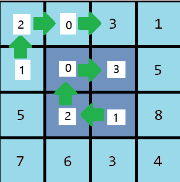

# PID 1902 · you love 1203!

[打开 HAUTOJ 原题 ↗](<https://acm.haut.edu.cn/problem.php?id=1902>){ .md-button .md-button--primary target="_blank" rel="noopener" }

!!! info "资料说明"
    本页是依据公开题面、公开解析与可复现代码核验整理的学习资料，不代表学校或校队的官方题解。

## 题目档案

| 项目 | 内容 |
|---|---|
| 训练定位 | 基础提高 |
| 主知识模块 | [数学、数论与组合](../topics/math-number-theory.md) |
| 知识标签 | 数学、数组与序列 |
| 时间 / 内存 | 1.000 S / 128 MB |
| 历史统计 | 5 次通过 / 20 次提交（25.0%） |
| 代码来源 | 依据公开题解整理 |
| 核验状态 | C++14 编译通过；1 个可机读公开样例/合法构造校验通过 |

接受率只反映抓取时的历史提交快照，不等于官方难度或选拔分数线。

## 周赛出处

- [河南工大2024新生周赛（6）——命题人：魏方](../contests/2024/1097.md) · E 题 · 5/20

## 题意与输入输出

**题意摘要**：根据给定输入，保证所有测试用例中 n⋅m 的总和不超过106 。 对于每个测试用例，输出一个数字-- 1203 按照顺时针的顺序出现在地毯各层的总次数。

**输入要点**：输入的第一行包含一个整数 t(1≤t≤100 ) - 测试用例的数量。下面几行描述测试用例。 每个测试用例的第一行包含一对数字n 和 m( 2≤n,m ≤ 103、 n,m -- 偶数整数)。 之后是长度为 m 的 n行，由 0至9的数字组成，即地毯的描述。

**输出要点**：保证所有测试用例中 n⋅m 的总和不超过106 。 对于每个测试用例，输出一个数字-- 1203 按照顺时针的顺序出现在地毯各层的总次数。

**题面提示**：&#91;图片：https://acm.haut.edu.cn/upload/acm.haut.edu.cn/image/20241129/20241129133748_64516.png&#93;

## 零基础先修

- 把过程转成公式前，先在小数据上验证，再证明公式覆盖所有合法情况。
- 明确 0/1 起下标、合法范围、首尾元素和扫描过程中保存的信息。

## 思路推导

1. 按输入说明读取数据，并用最小样例手算一次，确认每个变量的含义。
2. 从定义推导公式或不变量，并用小数据验证边界、奇偶与整除关系。
3. 核心处理：you love 1203! 本题就是一个暴力遍历， 我们将遍历地毯的所有层，并将每一层中遇到的1203记录数添加到答案中， 为此，我们可以遍历例如每层左上角的单元格，其形式为(i,i),i的范围是&#91;1,min(n,m)/2&#93;;然后使用简单算法遍历该层，将遇到的数字写入某个数组，然后遍历数组，计算该层中出现的1203，此外，在遍历数组是，我们应该考虑该层的循环性质，记得检查包含起始单元的1203是否可能出现，以及数组越界的情况。
4. 按题目要求输出，并检查最小值、最大值、重复值、单元素和格式边界。

## 正确性说明

- 推导把原过程转换为等价的公式或不变量。
- 算法直接计算该等价量，并使用足够宽的数据类型处理边界。
- 因此计算结果就是题目定义的答案。

## 复杂度

通常为 O(n)

## 易错点

- 乘积使用足够宽的数据类型；除法前处理除数为 0 和整数截断。
- 检查 0/1 起下标、n = 1、首尾元素和数组容量。

!!! tip "输出精度"
    `printf` 与 `fixed << setprecision(...)` 都是常见竞赛写法；区别和混用限制见[浮点输出专题](../guide/precision.md)。

## 题目摘要与 C++14 参考实现

--8<-- "includes/problems/haut-1902.md"

## 公开样例

### 样例 1

**输入**

```text
7
2 4
1203
7777
2 4
7120
8903
2 4
3021
8888
2 2
20
13
2 2
51
43
2 6
032012
212030
4 4
3021
1203
5518
7634
```

**输出**

```text
1
1
0
1
0
2
0
```


## 题面图片




## 训练动作

- 遮住代码，用 3～5 句话复述状态、步骤和复杂度，再独立实现。
- 自行补三个边界：最小规模、极端或全部相等、恰好卡在条件等号处。
- 将本题归档到“数学、数论与组合”，一周后限时重做。

## 链接与来源

- [HAUTOJ 原题](<https://acm.haut.edu.cn/problem.php?id=1902>)
- [公开题解/参考来源 1](<https://www.cnblogs.com/hautacm/p/18577386>)

---

<div class="problem-nav" markdown="1">
[← PID 1901](1901.md)
[返回题目索引](index.md)
[PID 1903 →](1903.md)
</div>
