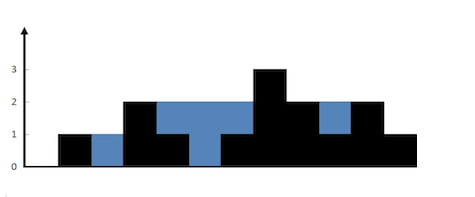

# PID 1904 · 山雨欲来！

[打开 HAUTOJ 原题 ↗](<https://acm.haut.edu.cn/problem.php?id=1904>){ .md-button .md-button--primary target="_blank" rel="noopener" }

!!! info "资料说明"
    本页是依据公开题面、公开解析与可复现代码核验整理的学习资料，不代表学校或校队的官方题解。

## 题目档案

| 项目 | 内容 |
|---|---|
| 训练定位 | 基础提高 |
| 主知识模块 | [数学、数论与组合](../topics/math-number-theory.md) |
| 知识标签 | 数论、数组与序列 |
| 时间 / 内存 | 1.000 S / 128 MB |
| 历史统计 | 42 次通过 / 91 次提交（46.2%） |
| 代码来源 | 依据公开题解整理 |
| 核验状态 | C++14 编译通过；1 个可机读公开样例/合法构造校验通过 |

接受率只反映抓取时的历史提交快照，不等于官方难度或选拔分数线。

## 周赛出处

- [河南工大2024新生周赛（6）——命题人：魏方](../contests/2024/1097.md) · G 题 · 42/91

## 题意与输入输出

**题意摘要**：根据给定输入，输出一个正整数，表示能够接到雨水的最大体积

**输入要点**：输入一个n(1&lt;=n&lt;=2*104)，表示柱子的数量，接下来输入n个整数a(1&lt;=a&lt;=105)，表示n个柱子的高度。

**输出要点**：输出一个正整数，表示能够接到雨水的最大体积

## 零基础先修

- 常用整除、gcd/lcm、质数与同余；乘法前先估算是否需要 long long 或 __int128。
- 明确 0/1 起下标、合法范围、首尾元素和扫描过程中保存的信息。

## 思路推导

1. 按输入说明读取数据，并用最小样例手算一次，确认每个变量的含义。
2. 从定义推导公式或不变量，并用小数据验证边界、奇偶与整除关系。
3. 核心处理：山雨欲来 动态规划 对于下标 i，下雨后水能到达的最大高度等于下标 i 两边的最大高度的最小值，下标 i 处能接的雨水量等于下标 i 处的水能到达的最大高度减去 height&#91;i&#93;。 朴素的做法是对于数组 height 中的每个元素，分别向左和向右扫描并记录左边和右边的最大高度，然后计算每个下标位置能接的雨水量。假设数组 height 的长度为 n，该做法需要对每个下标位置使用 O(n) 的时间向两边扫描并得到最大高度 上述做法的时间复杂度较高是因为需要对每个下标位置都向两边扫描。如果已经知道每个位置两边的最大高度，则可以在 O(n) 的时间内得到能接的雨水总量。使用动态规划的方法，可以在 O(n) 的时间内预处理得到每个位置两边的最大高度。 创建两个长度为 n 的数组 leftMax 和 rightMax。对于 0≤i&lt;n，leftMax&#91;i&#93; 表示下标 i 及其左边的位置中，height 的最大高度，rightMax&#91;i&#93; 表示下标 i 及其右边的位置中，height 的最大高度。 显然，leftMax&#91;0&#93;=height&#91;0&#93;，rightMax&#91;n−1&#93;=height&#91;n−1&#93;。两个数组的其余元素的计算如下： 当 1≤i≤n−1 时，leftMax&#91;i&#93;=max(leftMax&#91;i−1&#93;,height&#91;i&#93;)； 当 0≤i≤n−2 时，rightMax&#91;i&#93;=max(rightMax&#91;i+1&#93;,height&#91;i&#93;)。 因此可以正向遍历数组 height 得到数组 leftMax 的每个元素值，反向遍历数组 height 得到数组 rightMax 的每个元素值。 在得到数组 leftMax 和 rightMax 的每个元素值之后，对于 0≤i&lt;n，下标 i 处能接的雨水量等于 min(leftMax&#91;i&#93;,rightMax&#91;i&#93;)−height&#91;i&#93;。遍历每个下标位置即可得到能接的雨水总量。 本题与c语言版本不一样的仅有vector容器和max函数(取两个数的最大值)，与c语言中的数组起到的作用一样，所以不再提供c语言版本答案，知道vector相当与数组即可。
4. 按题目要求输出，并检查最小值、最大值、重复值、单元素和格式边界。

## 正确性说明

- 推导把原过程转换为等价的公式或不变量。
- 算法直接计算该等价量，并使用足够宽的数据类型处理边界。
- 因此计算结果就是题目定义的答案。

## 复杂度

O(n)

## 易错点

- 检查 gcd/lcm 的 0 值、负数和乘法溢出。
- 检查 0/1 起下标、n = 1、首尾元素和数组容量。

## 题目摘要与 C++14 参考实现

--8<-- "includes/problems/haut-1904.md"

## 公开样例

### 样例 1

**输入**

```text
12
0 1 0 2 1 0 1 3 2 1 2 1
```

**输出**

```text
6
```


## 题面图片




## 训练动作

- 遮住代码，用 3～5 句话复述状态、步骤和复杂度，再独立实现。
- 自行补三个边界：最小规模、极端或全部相等、恰好卡在条件等号处。
- 将本题归档到“数学、数论与组合”，一周后限时重做。

## 链接与来源

- [HAUTOJ 原题](<https://acm.haut.edu.cn/problem.php?id=1904>)
- [公开题解/参考来源 1](<https://www.cnblogs.com/hautacm/p/18577386>)

---

<div class="problem-nav" markdown="1">
[← PID 1903](1903.md)
[返回题目索引](index.md)
[PID 1905 →](1905.md)
</div>
