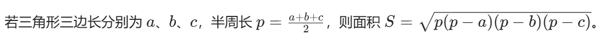

# PID 1940 · 魔法水晶的三角形测试

[打开 HAUTOJ 原题 ↗](<https://acm.haut.edu.cn/problem.php?id=1940>){ .md-button .md-button--primary target="_blank" rel="noopener" }

!!! info "资料说明"
    本页是依据公开题面、公开解析与可复现代码核验整理的学习资料，不代表学校或校队的官方题解。

## 题目档案

| 项目 | 内容 |
|---|---|
| 训练定位 | 进阶 |
| 主知识模块 | [数学、数论与组合](../topics/math-number-theory.md) |
| 知识标签 | 条件分支、数学 |
| 时间 / 内存 | 1.000 S / 128 MB |
| 历史统计 | 110 次通过 / 477 次提交（23.1%） |
| 代码来源 | 依据公开题解整理 |
| 核验状态 | C++14 编译通过；1 个可机读公开样例/合法构造校验通过 |

接受率只反映抓取时的历史提交快照，不等于官方难度或选拔分数线。

## 周赛出处

- [河南工大2025新生周赛（3）——命题人：路耀华](../contests/2025/1104.md) · H 题 · 110/477

## 题意与输入输出

### 题意摘要

根据给定输入，若不能构成三角形：输出一行 “It cannot form an energy triangle.”； 若能构成三角形：输出两行，第一行输出魔法属性（按上述优先级选择），第二行输出能量值（保留两位小数）。

### 输入要点

一行三个正整数a,b,c($1 \le a,b,c \le 1000$)，整数之间用空格分隔。

### 输出要点

若不能构成三角形：输出一行 “It cannot form an energy triangle.”；

若能构成三角形：输出两行，第一行输出魔法属性（按上述优先级选择），第二行输出能量值（保留两位小数）。

### 题面示意图




## 零基础先修

- if/else 按互斥条件选择处理路径；先覆盖特殊边界，再处理一般情况。
- 把过程转成公式前，先在小数据上验证，再证明公式覆盖所有合法情况。

## 思路推导

1. 按输入说明读取数据，并用最小样例手算一次，确认每个变量的含义。
2. 从定义推导公式或不变量，并用小数据验证边界、奇偶与整除关系。
3. 核心处理：魔法水晶的三角形测试 根据所给边判断是否能构成的三角形，如果可以构成三角形，求三角形类型并求面积。
4. 按题目要求输出，并检查最小值、最大值、重复值、单元素和格式边界。

## 正确性说明

- 推导把原过程转换为等价的公式或不变量。
- 算法直接计算该等价量，并使用足够宽的数据类型处理边界。
- 因此计算结果就是题目定义的答案。

## 复杂度

常数级或一次线性读入；以代码中的循环层数为准

## 易错点

- 条件应互斥并覆盖所有边界，尤其确认等号属于哪一侧。
- 乘积使用足够宽的数据类型；除法前处理除数为 0 和整数截断。

!!! tip "输出精度"
    `printf` 与 `fixed << setprecision(...)` 都是常见竞赛写法；区别和混用限制见[浮点输出专题](../guide/precision.md)。

## 题目摘要与 C++14 参考实现

--8<-- "includes/problems/haut-1940.md"

## 公开样例

### 样例 1

**输入**

```text
3 4 5
```

**输出**

```text
Right-angle crystal!
6.00
```


## 训练动作

- 遮住代码，用 3～5 句话复述状态、步骤和复杂度，再独立实现。
- 自行补三个边界：最小规模、极端或全部相等、恰好卡在条件等号处。
- 将本题归档到“数学、数论与组合”，一周后限时重做。

## 链接与来源

- [HAUTOJ 原题](<https://acm.haut.edu.cn/problem.php?id=1940>)
- [公开题解/参考来源 1](<https://www.cnblogs.com/hautacm/p/19208548>)

---

<div class="problem-nav" markdown="1">
[← PID 1939](1939.md)
[返回题目索引](index.md)
[PID 1941 →](1941.md)
</div>
