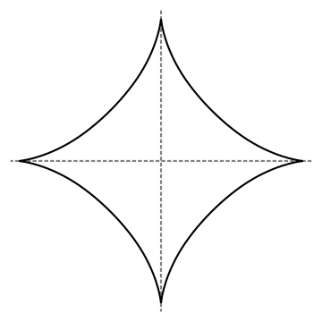
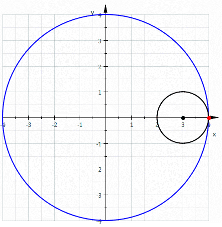

# PID 1942 · Starlight

[打开 HAUTOJ 原题 ↗](<https://acm.haut.edu.cn/problem.php?id=1942>){ .md-button .md-button--primary target="_blank" rel="noopener" }

!!! info "资料说明"
    本页是依据公开题面、公开解析与可复现代码核验整理的学习资料，不代表学校或校队的官方题解。

## 题目档案

| 项目 | 内容 |
|---|---|
| 训练定位 | 基础提高 |
| 主知识模块 | [计算几何、概率与综合](../topics/geometry-probability.md) |
| 知识标签 | 数学、计算几何、浮点误差 |
| 时间 / 内存 | 1.000 S / 128 MB |
| 历史统计 | 52 次通过 / 133 次提交（39.1%） |
| 代码来源 | 依据公开题面与解析独立改写 |
| 核验状态 | C++14 编译通过；1 个可机读公开样例/合法构造校验通过 |

接受率只反映抓取时的历史提交快照，不等于官方难度或选拔分数线。

## 周赛出处

- [河南工大2025新生周赛（7）——命题人：牛见青](../contests/2025/1109.md) · D 题 · 52/133

## 题意与输入输出

**题意摘要**：现在小光和华恋各自随机选择一个整数x、y，对应直角坐标上的点（x，y）；再由隔壁班的奈奈同学确定尺寸参数a，请你帮她们确定这个点是否在a决定的星形线内。

**输入要点**：一行，三个整数x，y，a，由空格隔开，其中a&gt;0。

**输出要点**：一行，若在星形线围成的图形内输出“Position Zero!”，若在线外输出“Fly Me to the Star”。 特殊地，在边上（误差小于1e-6），输出“Non Non Da Yo” 。

## 零基础先修

- 把过程转成公式前，先在小数据上验证，再证明公式覆盖所有合法情况。
- 明确坐标系、距离与边界；只比较距离时可用平方距离避免开方。
- 不要用 == 比较计算得到的浮点数；按题目要求处理绝对或相对误差。

## 思路推导

1. 按输入说明读取数据，并用最小样例手算一次，确认每个变量的含义。
2. 从定义推导公式或不变量，并用小数据验证边界、奇偶与整除关系。
3. 核心处理：星形线边界满足 |x|^(2/3)+|y|^(2/3)=a^(2/3)。计算左右两边 的差：绝对值小于 1e-6 判为边界，左边更小在内部，否则在外部。 对负坐标必须先取绝对值，否则分数幂会产生 NaN。
4. 按题目要求输出，并检查最小值、最大值、重复值、单元素和格式边界。

## 正确性说明

- 推导把原过程转换为等价的公式或不变量。
- 算法直接计算该等价量，并使用足够宽的数据类型处理边界。
- 因此计算结果就是题目定义的答案。

## 复杂度

O(1) 时间、O(1) 空间

## 易错点

- 乘积使用足够宽的数据类型；除法前处理除数为 0 和整数截断。

## 题目摘要与 C++14 参考实现

--8<-- "includes/problems/haut-1942.md"

## 公开样例

### 样例 1

**输入**

```text
0 0 1
```

**输出**

```text
Position Zero!
```


## 题面图片






## 训练动作

- 遮住代码，用 3～5 句话复述状态、步骤和复杂度，再独立实现。
- 自行补三个边界：最小规模、极端或全部相等、恰好卡在条件等号处。
- 将本题归档到“计算几何、概率与综合”，一周后限时重做。

## 链接与来源

- [HAUTOJ 原题](<https://acm.haut.edu.cn/problem.php?id=1942>)
- [公开题解/参考来源 1](<https://www.cnblogs.com/hautacm/p/19323199>)

---

<div class="problem-nav" markdown="1">
[← PID 1941](1941.md)
[返回题目索引](index.md)
[PID 1943 →](1943.md)
</div>
