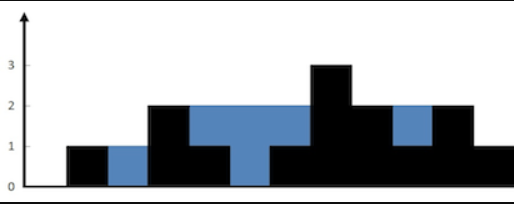

# PID 1966 · 阳台接雨

[打开 HAUTOJ 原题 ↗](<https://acm.haut.edu.cn/problem.php?id=1966>){ .md-button .md-button--primary target="_blank" rel="noopener" }

!!! info "资料说明"
    本页是依据公开题面、公开解析与可复现代码核验整理的学习资料，不代表学校或校队的官方题解。

## 题目档案

| 项目 | 内容 |
|---|---|
| 训练定位 | 基础提高 |
| 主知识模块 | [数组、字符串与双指针](../topics/arrays-strings.md) |
| 知识标签 | 数组与序列 |
| 时间 / 内存 | 1.000 S / 128 MB |
| 历史统计 | 28 次通过 / 107 次提交（26.2%） |
| 代码来源 | 依据公开题解整理 |
| 核验状态 | C++17 编译通过；1 个可机读公开样例/合法构造校验通过 |

接受率只反映抓取时的历史提交快照，不等于官方难度或选拔分数线。

## 周赛出处

- [河南工大2025新生周赛（5）——命题人：袁林坤](../contests/2025/1106.md) · E 题 · 28/107

## 题意与输入输出

**题意摘要**：根据给定输入，一个整数，表示这排花架最多能储存的立方米雨水。

**输入要点**：第一行一个整数n，表示n块挡板。 接下来是挡板高度数组H=&#91;a1,a2,...,an&#93;。

**输出要点**：一个整数，表示这排花架最多能储存的立方米雨水。

**题面提示**：&#91;图片：https://acm.haut.edu.cn/upload/acm.haut.edu.cn/image/20251118/20251118134849_98431.png&#93; 1 &lt;= n &lt;= 2 * 10^4 0 &lt;= a&#91;i&#93; &lt;= 10^5

## 零基础先修

- 明确 0/1 起下标、合法范围、首尾元素和扫描过程中保存的信息。

## 思路推导

1. 按输入说明读取数据，并用最小样例手算一次，确认每个变量的含义。
2. 把条件翻译成分支或线性扫描，不引入题目没有要求的额外状态。
3. 核心处理：阳台接雨 线性dp,两个数组分别存储前后最大值，两边最大值的最小值与当前值相减即可。
4. 按题目要求输出，并检查最小值、最大值、重复值、单元素和格式边界。

## 正确性说明

- 扫描前保存的信息与已经处理的输入完全对应。
- 每读入一个元素，分支覆盖其全部情况并正确更新累计状态。
- 扫描结束时所有输入恰好处理一次，累计状态即为所求。

## 复杂度

o(0)

## 易错点

- 检查 0/1 起下标、n = 1、首尾元素和数组容量。
- 按上界估算中间量，相关变量不要退回 int。

## 题目摘要与 C++17 参考实现

--8<-- "includes/problems/haut-1966.md"

## 公开样例

### 样例 1

**输入**

```text
12
0 1 0 2 1 0 1 3 2 1 2 1
```

**输出**

```text
6
```


## 题面图片




## 训练动作

- 遮住代码，用 3～5 句话复述状态、步骤和复杂度，再独立实现。
- 自行补三个边界：最小规模、极端或全部相等、恰好卡在条件等号处。
- 将本题归档到“数组、字符串与双指针”，一周后限时重做。

## 链接与来源

- [HAUTOJ 原题](<https://acm.haut.edu.cn/problem.php?id=1966>)
- [公开题解/参考来源 1](<https://www.cnblogs.com/hautacm/p/19269338>)

---

<div class="problem-nav" markdown="1">
[← PID 1965](1965.md)
[返回题目索引](index.md)
[PID 1967 →](1967.md)
</div>
