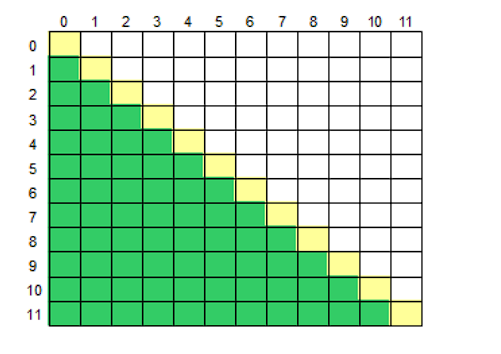

# PID 1978 · 数组求和

[打开 HAUTOJ 原题 ↗](<https://acm.haut.edu.cn/problem.php?id=1978>){ .md-button .md-button--primary target="_blank" rel="noopener" }

!!! info "资料说明"
    本页是依据公开题面、公开解析与可复现代码核验整理的学习资料，不代表学校或校队的官方题解。

## 题目档案

| 项目 | 内容 |
|---|---|
| 训练定位 | 基础提高 |
| 主知识模块 | [数学、数论与组合](../topics/math-number-theory.md) |
| 知识标签 | 数组与序列、数论、字符串 |
| 时间 / 内存 | 1.000 S / 128 MB |
| 历史统计 | 83 次通过 / 173 次提交（48.0%） |
| 代码来源 | 依据公开题解整理 |
| 核验状态 | C++14 编译通过；1 个可机读公开样例/合法构造校验通过 |

接受率只反映抓取时的历史提交快照，不等于官方难度或选拔分数线。

## 周赛出处

- [河南工大2025新生周赛（6）——命题人：张康发](../contests/2025/1107.md) · E 题 · 83/173

## 题意与输入输出

**题意摘要**：输入一个二维数组M&#91;12&#93;&#91;12&#93;,根据输入要求，求出二维数组的左下部分元素的平均值或元素的和。

**输入要点**：第一行输入一个大写字母，若为 S，则表示需要求出左下半部分的元素的和，若为 M，则表示需要求出左下半部分的元素的平均值。 接下来 12 行，每行包含 12 个用空格隔开的浮点数，表示这个二维数组，其中第 i+1 行的第 j+1 个数表示数组元素 M&#91;i&#93;&#91;j&#93;。

**输出要点**：输出一个数，表示所求的平均数或和的值，保留一位小数。

## 零基础先修

- 明确 0/1 起下标、合法范围、首尾元素和扫描过程中保存的信息。
- 常用整除、gcd/lcm、质数与同余；乘法前先估算是否需要 long long 或 __int128。
- string 可按下标访问字符；注意空串、大小写、标点和 getline 与 cin 的衔接。

## 思路推导

1. 按输入说明读取数据，并用最小样例手算一次，确认每个变量的含义。
2. 从定义推导公式或不变量，并用小数据验证边界、奇偶与整除关系。
3. 核心处理：数组求和 遍历求和即可。 #include &lt;stdio.h&gt; #include &lt;string.h&gt;
4. 按题目要求输出，并检查最小值、最大值、重复值、单元素和格式边界。

## 正确性说明

- 推导把原过程转换为等价的公式或不变量。
- 算法直接计算该等价量，并使用足够宽的数据类型处理边界。
- 因此计算结果就是题目定义的答案。

## 复杂度

通常为 O(n)

## 易错点

- 检查 0/1 起下标、n = 1、首尾元素和数组容量。
- 检查 gcd/lcm 的 0 值、负数和乘法溢出。
- 避免下标越界；getline 前要处理上一次格式化读入留下的换行。

!!! tip "输出精度"
    `printf` 与 `fixed << setprecision(...)` 都是常见竞赛写法；区别和混用限制见[浮点输出专题](../guide/precision.md)。

## 题目摘要与 C++14 参考实现

--8<-- "includes/problems/haut-1978.md"

## 公开样例

### 样例 1

**输入**

```text
S
8.7 5.6 -2.0 -2.1 -7.9 -9.0 -6.4 1.7 2.9 -2.3 8.4 4.0
-7.3 -2.1 0.6 -9.8 9.6 5.6 -1.3 -3.8 -9.3 -8.0 -2.0 2.9
-4.9 -0.5 -5.5 -0.2 -4.4 -6.1 7.6 6.9 -8.0 6.8 9.1 -8.5
-1.3 5.5 4.6 6.6 8.1 7.9 -9.3 9.6 4.6 0.9 -3.5 -4.3
-7.0 -1.2 7.0 7.1 -5.7 7.8 -2.3 4.3 0.2 -0.4 -6.6 7.6
-3.2 -5.4 -4.7 4.7 3.6 8.8 5.1 -3.1 -2.9 2.8 -4.3 -1.4
-1.8 -3.3 -5.6 1.8 8.3 -0.5 2.0 -3.9 -1.0 -8.6 8.0 -3.3
-2.5 -9.8 9.2 -0.8 -9.4 -0.5 1.6 1.5 3.4 -0.1 7.0 -6.2
-1.0 4.9 2.2 -8.7 -0.9 4.8 2.3 2.0 -3.2 -7.5 -4.0 9.9
-1.1 -2.9 8.7 3.6 7.4 7.8 10.0 -9.0 1.6 8.3 6.3 -5.8
-9.9 0.6 2.0 -3.8 -6.3 0.6 7.3 3.8 -7.1 9.5 2.2 1.3
-2.8 -9.1 7.1 -0.2 0.6 -6.5 1.1 -0.1 -3.6 4.0 -5.4 1.1
```

**输出**

```text
-2.8
```


## 题面图片




## 训练动作

- 遮住代码，用 3～5 句话复述状态、步骤和复杂度，再独立实现。
- 自行补三个边界：最小规模、极端或全部相等、恰好卡在条件等号处。
- 将本题归档到“数学、数论与组合”，一周后限时重做。

## 链接与来源

- [HAUTOJ 原题](<https://acm.haut.edu.cn/problem.php?id=1978>)
- [公开题解/参考来源 1](<https://www.cnblogs.com/hautacm/p/19297290>)

---

<div class="problem-nav" markdown="1">
[← PID 1977](1977.md)
[返回题目索引](index.md)
[PID 1979 →](1979.md)
</div>
