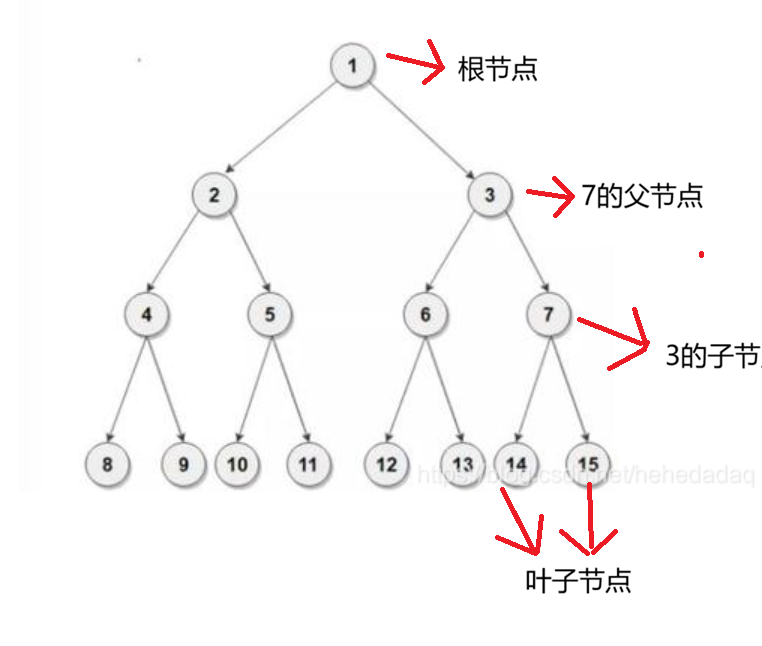

# PID 1983 · 非常会伪装的金钱树

[打开 HAUTOJ 原题 ↗](<https://acm.haut.edu.cn/problem.php?id=1983>){ .md-button .md-button--primary target="_blank" rel="noopener" }

!!! info "资料说明"
    本页是依据公开题面、公开解析与可复现代码核验整理的学习资料，不代表学校或校队的官方题解。

## 题目档案

| 项目 | 内容 |
|---|---|
| 训练定位 | 基础提高 |
| 主知识模块 | [动态规划](../topics/dynamic-programming.md) |
| 知识标签 | 动态规划、最长非降子序列、二分 |
| 时间 / 内存 | 1.000 S / 128 MB |
| 历史统计 | 36 次通过 / 60 次提交（60.0%） |
| 代码来源 | 依据公开题面与解析独立改写 |
| 核验状态 | C++17 编译通过；1 个可机读公开样例/合法构造校验通过 |

接受率只反映抓取时的历史提交快照，不等于官方难度或选拔分数线。

## 周赛出处

- [河南工大2025新生周赛（8）——命题人：庞贺航、高旭](../contests/2025/1110.md) · E 题 · 36/60

## 题意与输入输出

**题意摘要**：给定一组节点，每个节点有一个权值，要求以如下规则建出一颗高度最大的树，输出该树的高度。（树的高度详见提示）

**输入要点**：输入共两行。 第一行一个整数n。表示共n个节点。 第二行共n个整数。第i个整数表示第i个节点的值。

**输出要点**：输出一个整数。即能建出的树的最大高度。

**题面提示**：0&lt;n&lt;=1000 0&lt;ni&lt;=1000 树的高度：树从根结点开始往下数，叶子结点所在的最大层数称为树的高度 树上的节点有上下两层与其直接相连的节点，在该节点的上层且有唯一与其相连的节点称为该节点的父节点，在该节点的下层且允许有多个与其相连的节点称为该节点的子节点 &#91;图片：https://acm.haut.edu.cn/upload/acm.haut.edu.cn/image/20251215/20251215153128_40038.png&#93; /*这个金钱树真的很会伪装*/

## 零基础先修

- 用一句话定义 dp 状态，再写转移来源、初值、遍历顺序和最终答案。

## 思路推导

1. 按输入说明读取数据，并用最小样例手算一次，确认每个变量的含义。
2. 定义 dp 状态、初值和遍历顺序，只从合法状态转移。
3. 核心处理：维护 tails&#91;len-1&#93;：长度为 len 的非降子序列目前能取得的最小末尾。 当前值可接在所有 ≤它的末尾之后，因此用 upper_bound 找第一个大于 当前值的位置并替换；找不到就扩展答案。
4. 按题目要求输出，并检查最小值、最大值、重复值、单元素和格式边界。

## 正确性说明

- 状态保存当前阶段所需的全部信息，初始状态与空前缀或空选择一致。
- 转移枚举所有合法来源，因此不漏解；取最优值时也不会保留劣解。
- 处理完全部输入后，目标状态正好对应题目要求。

## 复杂度

O(n log n) 时间、O(n) 空间

## 易错点

- 初值不能默认全部可达；0/1 背包必须倒序遍历容量。
- 按上界估算中间量，相关变量不要退回 int。

## 题目摘要与 C++17 参考实现

--8<-- "includes/problems/haut-1983.md"

## 公开样例

### 样例 1

**输入**

```text
6
3 1 2 7 2 4
```

**输出**

```text
4
```


## 题面图片




## 训练动作

- 遮住代码，用 3～5 句话复述状态、步骤和复杂度，再独立实现。
- 自行补三个边界：最小规模、极端或全部相等、恰好卡在条件等号处。
- 将本题归档到“动态规划”，一周后限时重做。

## 链接与来源

- [HAUTOJ 原题](<https://acm.haut.edu.cn/problem.php?id=1983>)
- [公开题解/参考来源 1](<https://www.cnblogs.com/hautacm/p/19357178>)

---

<div class="problem-nav" markdown="1">
[← PID 1982](1982.md)
[返回题目索引](index.md)
[PID 1984 →](1984.md)
</div>
